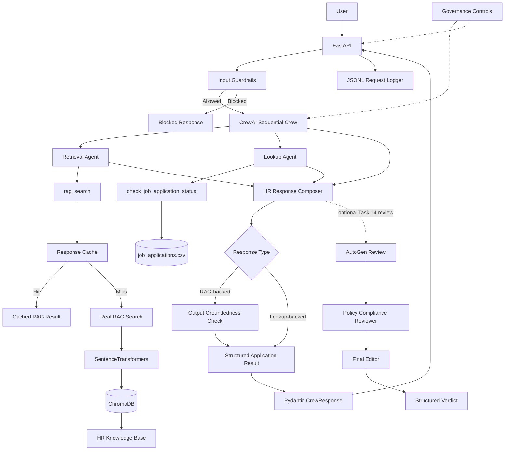

# Naukri.com Domain Support Agent

**Track Completed: Naukri.com (Recruitment & HR)**

An AI-powered **Recruitment & HR domain support agent** that combines:

* Retrieval-Augmented Generation (RAG)
* Local SentenceTransformers embeddings
* ChromaDB vector retrieval
* CrewAI multi-agent orchestration
* Session-based memory
* Pydantic structured outputs
* Input and output guardrails
* FastAPI deployment
* WebSocket real-time chat
* Structured JSONL logging
* AutoGen governance review
* Runtime token and cost controls
* Normalized-query response caching
* Deterministic `MOCK_LLM` execution

This repository implements the complete Final Capstone across **Tasks 1–16** in one public GitHub repository.

The system is designed as a grounded Recruitment & HR support agent rather than a generic chatbot:

* HR policy questions are answered from a controlled knowledge base.
* Application-status questions are answered through a dedicated structured lookup tool.
* Unsupported knowledge-base questions trigger a grounded fallback.
* Privileged application lookup is restricted to the designated Lookup Agent.
* Session memory supports same-session follow-up questions without leaking context into a fresh session.
* Repeated grounded-generation requests can be served from an in-memory normalized-query cache.
* CrewAI responses are validated through a Pydantic schema.
* AutoGen provides an independent policy-compliance review stage.
* Runtime governance controls token and synthetic cost limits.

---

# Table of Contents

* [1. Project Overview](#1-project-overview)
* [2. Capstone Scope](#2-capstone-scope)
* [3. Objectives](#3-objectives)
* [4. Architecture](#4-architecture)
* [5. Technology Stack](#5-technology-stack)
* [6. Repository Structure](#6-repository-structure)
* [7. Part 1 - Dataset, Knowledge Base and RAG](#7-part-1---dataset-knowledge-base-and-rag)

  * [7.1 Task 1 - Dataset Generation](#71-task-1---dataset-generation)
  * [7.2 Task 2 - Knowledge Base](#72-task-2---knowledge-base)
  * [7.3 Task 3 - Chunking Strategies](#73-task-3---chunking-strategies)
  * [7.4 Task 3 - Embeddings and ChromaDB](#74-task-3---embeddings-and-chromadb)
  * [7.5 Task 4 - Grounded Generation](#75-task-4---grounded-generation)
  * [7.6 Task 4 - Empirical Threshold Calibration](#76-task-4---empirical-threshold-calibration)
  * [7.7 Task 5 - Precision and Recall Evaluation](#77-task-5---precision-and-recall-evaluation)
* [8. Part 2 - CrewAI Agent System](#8-part-2---crewai-agent-system)

  * [8.1 Task 6 - Application Lookup and Escalation Score](#81-task-6---application-lookup-and-escalation-score)
  * [8.2 Task 7 - CrewAI Agents](#82-task-7---crewai-agents)
  * [8.3 Task 8 - Session Memory](#83-task-8---session-memory)
  * [8.4 Task 9 - Structured Output](#84-task-9---structured-output)
  * [8.5 Task 10 - Guardrails](#85-task-10---guardrails)
* [9. Part 3 - FastAPI, Logging and Evaluation](#9-part-3---fastapi-logging-and-evaluation)

  * [9.1 Task 11 - FastAPI Deployment](#91-task-11---fastapi-deployment)
  * [9.2 Task 12 - Structured JSONL Logging](#92-task-12---structured-jsonl-logging)
  * [9.3 Task 13 - End-to-End Evaluation](#93-task-13---end-to-end-evaluation)
* [10. Part 4 - Governance and Optimization](#10-part-4---governance-and-optimization)

  * [10.1 Task 14 - AutoGen Review](#101-task-14---autogen-review)
  * [10.2 Task 15 - AI Governance](#102-task-15---ai-governance)
  * [10.3 Task 16 - Response Caching](#103-task-16---response-caching)
* [11. Key Design Decisions](#11-key-design-decisions)
* [12. How to Run](#12-how-to-run)
* [13. Demonstration and Evidence](#13-demonstration-and-evidence)
* [14. Acceptance Criteria Checklist](#14-acceptance-criteria-checklist)
* [15. Design Summary by Task](#15-design-summary-by-task)
* [16. Key Results](#16-key-results)
* [17. Reproducibility Notes](#17-reproducibility-notes)
* [18. Limitations](#18-limitations)
* [19. Conclusion](#19-conclusion)
* [20. Main Files](#20-main-files)
* [21. Final Project Status](#21-final-project-status)

---

# 1. Project Overview

The **Naukri.com Domain Support Agent** is a Recruitment & HR support system designed to answer questions across controlled HR policy content and structured job-application information.

Supported knowledge-base topics include:

* Job-application eligibility
* Interview scheduling
* Offer negotiation
* Background verification
* Notice period
* Referral bonus
* Internal transfer
* Probation period
* Remote work
* Diversity hiring
* Exit interview
* Applicant-data retention

The system also supports:

* Job-application status lookup
* Expected salary lookup
* Application escalation scoring
* Same-session follow-up questions
* PII masking
* Prompt-injection blocking
* Groundedness fallback
* API access
* WebSocket chat
* Structured audit logging
* Governance review
* Runtime token and cost limits
* RAG response caching

The architecture intentionally separates **policy evidence** from **application records**.

## Knowledge-base questions

Knowledge-base questions use the RAG path:

```text
User Query
    |
    v
Input Guardrails
    |
    v
CrewAI Retrieval Agent
    |
    v
rag_search()
    |
    v
Normalized Query Cache
    |
    +----------------------+
    |                      |
    v                      v
Cache Hit              Cache Miss
    |                      |
    v                      v
Cached Result        Real RAG Search
                           |
                           v
                  SentenceTransformers
                           |
                           v
                        ChromaDB
                           |
                           v
                    HR Knowledge Base
                           |
                           v
                  Top-1 Similarity
                           |
                           v
                 Grounded / Fallback
```

## Application-status questions

Application-specific questions use a separate structured path:

```text
User Query
    |
    v
Input Guardrails
    |
    v
CrewAI Lookup Agent
    |
    v
check_job_application_status(record_id)
    |
    v
job_applications.csv
    |
    v
Structured Application Facts
```

This separation is deliberate.

The RAG path uses semantic retrieval and the empirically calibrated `RAG_THRESHOLD`.

The application-status path uses structured application facts directly from the generated dataset and therefore does not rely on Chroma similarity.

---

# 2. Capstone Scope

This repository implements all four parts of the supplied Final Capstone problem statement.

| Part   | Scope                                                                                              |
| ------ | -------------------------------------------------------------------------------------------------- |
| Part 1 | Dataset design, knowledge base, embeddings, ChromaDB, RAG, threshold calibration, precision/recall |
| Part 2 | CrewAI agents, tools, memory, structured output, guardrails                                        |
| Part 3 | FastAPI, WebSocket, JSONL logging, 15-query evaluation                                             |
| Part 4 | AutoGen review, least autonomy, risk classification, runtime budgets, response caching             |

The project is designed to operate under the required deterministic `MOCK_LLM` workflow.

No paid LLM API account is required for the graded local workflow.

---

# 3. Objectives

The project objectives are to:

1. Build a deterministic synthetic job-application dataset.
2. Cover all required Recruitment & HR knowledge-base topics.
3. Compare fixed-size and sentence-based RAG chunking strategies.
4. Generate local embeddings and store them in ChromaDB.
5. Calibrate a groundedness threshold empirically.
6. Build a three-agent CrewAI workflow.
7. Separate retrieval and application-lookup responsibilities.
8. Maintain session memory within the running process.
9. Validate CrewAI responses using Pydantic.
10. Apply input and output guardrails.
11. Expose the workflow through FastAPI.
12. Support WebSocket-based multi-turn chat.
13. Produce structured JSONL audit records.
14. Evaluate exactly 15 queries using Accuracy, Grounding, Completeness and Safety.
15. Add an independent AutoGen policy/compliance review stage.
16. Enforce least-autonomy and runtime-budget controls.
17. Avoid redundant grounded-generation work through response caching.

---

# 4. Architecture

## End-to-End Architecture



## Core RAG Response Path

```text
Question
    |
    v
Input Guardrails
    |
    v
Retrieval Agent
    |
    v
rag_search(query)
    |
    v
Normalized Query Cache
    |
    +------------------------------+
    |                              |
    v                              v
Cache Hit                      Cache Miss
    |                              |
    v                              v
Cached Result                _real_rag_search()
                                   |
                                   v
                          Embedding Generation
                                   |
                                   v
                                ChromaDB
                                   |
                                   v
                               Top-K Chunks
                                   |
                                   v
                           Top-1 Similarity
                                   |
                                   v
                          Grounded / Fallback
```

## Application Lookup Path

```text
Question with Record ID
        |
        v
Input Guardrails
        |
        v
Lookup Agent
        |
        v
check_job_application_status()
        |
        v
job_applications.csv
        |
        v
Status + Expected Salary + Escalation Score
```

## Governance Path

```text
CrewAI Draft
    |
    v
Policy-Compliance-Reviewer
    |
    v
Final-Editor
    |
    v
Pydantic Verdict
```

---

# 5. Technology Stack

| Technology                               | Purpose                                |
| ---------------------------------------- | -------------------------------------- |
| Python                                   | Main implementation language           |
| SentenceTransformers                     | Local embedding generation             |
| `sentence-transformers/all-MiniLM-L6-v2` | Embedding model                        |
| ChromaDB                                 | Local vector database                  |
| CrewAI                                   | Multi-agent orchestration              |
| LangChain Core                           | Session memory integration             |
| Pydantic                                 | Structured request/response validation |
| FastAPI                                  | HTTP API                               |
| WebSockets                               | Real-time chat                         |
| AutoGen AgentChat                        | Independent governance review          |
| CSV                                      | Synthetic application records          |
| JSONL                                    | Structured request logging             |
| In-memory cache                          | RAG response caching                   |
| `python-dotenv`                          | Environment configuration support      |

The validated CrewAI version is:

```text
crewai==1.15.18
```

The dependency definition is stored in:

```text
requirements.txt
```

---

# 6. Repository Structure

```text
naukri-domain-support-agent/
│
├── dataset.py
├── job_applications.csv
│
├── rag_core.py
├── chroma_db/
│
├── knowledge_base/
│   ├── 01_eligibility_criteria.txt
│   ├── 02_interview_scheduling.txt
│   ├── 03_offer_negotiation.txt
│   ├── 04_background_verification.txt
│   ├── 05_notice_period.txt
│   ├── 06_referral_bonus.txt
│   ├── 07_internal_transfer.txt
│   ├── 08_probation_period.txt
│   ├── 09_remote_work.txt
│   ├── 10_diversity_hiring.txt
│   ├── 11_exit_interview.txt
│   └── 12_data_retention.txt
│
├── crew_agents.py
├── task6_tool.py
├── guardrails.py
├── task_10.py
├── api.py
├── request_logger.py
├── autogen_review.py
├── governance.py
├── response_cache.py
├── test_websocket.py
│
├── eval/
│   ├── task13_judge_eval.py
│   ├── task13_results.json
│   └── task13_results.csv
│
├── logs/
│   └── requests.jsonl
│
├── requirements.txt
├── .gitignore
└── README.md
```

---

# 7. Part 1 - Dataset, Knowledge Base and RAG

## 7.1 Task 1 - Dataset Generation

`dataset.py` generates a deterministic synthetic job-application dataset.

### Dataset configuration

```python
SEED = 42
NUM_RECORDS = 50
OUTPUT_FILE = "job_applications.csv"
```

The generated dataset contains:

```text
50 job-application records
```

This exceeds the capstone minimum of 40 records.

### Required categories

The dataset contains all five required categories:

```text
Software Engineer
Data Analyst
Product Manager
HR Executive
Sales Associate
```

Each required category appears at least three times.

### Required statuses

All five required statuses are represented:

```text
Applied
Screening
Interview Scheduled
Offered
Rejected
```

### Required record fields

Every record includes:

```text
record_id
category
status
expected_salary_inr
days_since_created
flagged_priority_review
```

The dataset also contains additional fabricated candidate information for application lookup demonstrations.

### Salary range

The selected synthetic salary range is:

```text
₹4,00,000 - ₹18,00,000 per year
```

This range is used consistently by the deterministic dataset generator.

### Application-age range

```text
days_since_created: 0-30
```

### Priority-review flag

The percentage of applications with:

```text
flagged_priority_review = True
```

is validated to remain within the required:

```text
10%-30%
```

range.

### Dataset validation

`dataset.py` validates:

* Record count
* Required category coverage
* Minimum category counts
* Required status coverage
* Salary range
* Application-age range
* Priority-review percentage
* Required record fields

The dataset is generated using a fixed seed so that the design is reproducible.

---

## 7.2 Task 2 - Knowledge Base

The project contains the 12 required Recruitment & HR knowledge-base documents.

| Topic                                | File                             |
| ------------------------------------ | -------------------------------- |
| Job-application eligibility criteria | `01_eligibility_criteria.txt`    |
| Interview-scheduling process         | `02_interview_scheduling.txt`    |
| Offer-negotiation policy             | `03_offer_negotiation.txt`       |
| Background-verification process      | `04_background_verification.txt` |
| Notice-period policy                 | `05_notice_period.txt`           |
| Referral-bonus policy                | `06_referral_bonus.txt`          |
| Internal-transfer eligibility        | `07_internal_transfer.txt`       |
| Probation-period policy              | `08_probation_period.txt`        |
| Remote-work eligibility              | `09_remote_work.txt`             |
| Diversity-hiring guidelines          | `10_diversity_hiring.txt`        |
| Exit-interview process               | `11_exit_interview.txt`          |
| Applicant-data-retention policy      | `12_data_retention.txt`          |

Each document contains four sentences, satisfying the capstone requirement of **2–5 sentences per document**.

The knowledge-base content is project-created material for the capstone and is not presented as live Naukri.com policy.

---

## 7.3 Task 3 - Chunking Strategies

Two independent chunking strategies are implemented.

### Fixed-size chunking

```text
Chunk size = 200 characters
Overlap = 50 characters
```

### Sentence-based chunking

```text
2 sentences per chunk
```

Each chunk retains its originating source-document identity.

This allows Task 5 evaluation to map retrieved chunks back to parent documents before computing document-level precision and recall.

---

## 7.4 Task 3 - Embeddings and ChromaDB

The local embedding model is:

```text
sentence-transformers/all-MiniLM-L6-v2
```

The two retrieval strategies use separate ChromaDB collections:

```text
fixed_chunks
sentence_chunks
```

The configured retrieval depth is:

```text
TOP_K = 3
```

The final clean build produces:

```text
Fixed-size chunks: 45
Sentence-based chunks: 24
```

The vector pipeline runs locally and does not require a paid embedding API.

---

## 7.5 Task 4 - Grounded Generation

The production CrewAI RAG path uses:

```text
fixed_chunks
```

as the deployed retrieval collection.

The production RAG flow:

1. Receives the user question.
2. Applies input guardrails.
3. Generates a local query embedding.
4. Searches the production `fixed_chunks` collection.
5. Retrieves the top `TOP_K` chunks.
6. Examines the top-1 similarity.
7. Compares that score against the empirically calibrated threshold.
8. Returns grounded information when retrieval is sufficiently supported.
9. Returns an explicit fallback when retrieval is below the threshold.

The fallback is:

```text
I don't know based on the available knowledge base.
```

This prevents weak semantic matches from being turned into unsupported HR answers.

---

## 7.6 Task 4 - Empirical Threshold Calibration

The production threshold is not hard-coded to a generic similarity value such as `0.5`, `0.6`, or `0.7`.

The calibration is performed on the **same `fixed_chunks` collection used by the production RAG path**.

### In-scope calibration measurements

| Query                                                        | Collection     | Top-1 cosine similarity |
| ------------------------------------------------------------ | -------------- | ----------------------: |
| What degree is required for most professional jobs?          | `fixed_chunks` |                  0.5823 |
| How much notice should a candidate get before an interview?  | `fixed_chunks` |                  0.6734 |
| What is the normal employee notice period after resignation? | `fixed_chunks` |                  0.7583 |
| How much is the employee referral bonus?                     | `fixed_chunks` |                  0.7528 |
| When can an employee apply for an internal transfer?         | `fixed_chunks` |                  0.8041 |
| How long is the normal probation period?                     | `fixed_chunks` |                  0.7232 |

The lowest measured in-scope score is approximately:

```text
0.5823
```

### Out-of-scope calibration measurements

| Query                                      | Collection     | Top-1 cosine similarity |
| ------------------------------------------ | -------------- | ----------------------: |
| What is the capital of France?             | `fixed_chunks` |                  0.0890 |
| What is the weather forecast for tomorrow? | `fixed_chunks` |                  0.1275 |
| How do I bake a chocolate cake?            | `fixed_chunks` |                  0.1165 |

The highest measured out-of-scope score is approximately:

```text
0.1275
```

### Chosen threshold

The threshold is derived from the measured separation between the observed in-scope and out-of-scope groups.

The final production threshold is:

```text
RAG_THRESHOLD = 0.3549
```

Therefore:

```text
similarity >= 0.3549
    -> accept retrieval as sufficiently grounded

similarity < 0.3549
    -> return grounded fallback
```

The threshold is dataset-specific and tied to the production retrieval configuration.

Whenever the knowledge base, embedding model, chunking strategy or production collection materially changes, Task 4 calibration should be regenerated.

---

## 7.7 Task 5 - Precision and Recall Evaluation

Task 5 evaluates the same five in-scope queries independently against both chunking strategies.

Retrieved chunks are mapped to their parent source documents before scoring.

Multiple retrieved chunks from the same source document count as one retrieved document.

### Fixed-size `fixed_chunks`

#### Query: What degree is required for most professional jobs?

```text
Retrieved documents:
['01_eligibility_criteria']

Ground-truth documents:
['01_eligibility_criteria']

Precision = 1 / 1 = 1.0000
Recall    = 1 / 1 = 1.0000
```

#### Query: How much notice should a candidate get before an interview?

```text
Retrieved documents:
['02_interview_scheduling']

Ground-truth documents:
['02_interview_scheduling']

Precision = 1 / 1 = 1.0000
Recall    = 1 / 1 = 1.0000
```

#### Query: What is the normal employee notice period after resignation?

```text
Retrieved documents:
['05_notice_period']

Ground-truth documents:
['05_notice_period']

Precision = 1 / 1 = 1.0000
Recall    = 1 / 1 = 1.0000
```

#### Query: How much is the employee referral bonus?

```text
Retrieved documents:
['06_referral_bonus']

Ground-truth documents:
['06_referral_bonus']

Precision = 1 / 1 = 1.0000
Recall    = 1 / 1 = 1.0000
```

#### Query: When can an employee apply for an internal transfer?

```text
Retrieved documents:
['07_internal_transfer']

Ground-truth documents:
['07_internal_transfer']

Precision = 1 / 1 = 1.0000
Recall    = 1 / 1 = 1.0000
```

### Fixed-size averages

```text
Precision = 1.0000
Recall    = 1.0000
```

### Sentence-based `sentence_chunks`

#### Query: What degree is required for most professional jobs?

```text
Retrieved documents:
['01_eligibility_criteria', '09_remote_work', '10_diversity_hiring']

Ground-truth documents:
['01_eligibility_criteria']

Precision = 1 / 3 = 0.3333
Recall    = 1 / 1 = 1.0000
```

#### Query: How much notice should a candidate get before an interview?

```text
Retrieved documents:
['02_interview_scheduling', '10_diversity_hiring']

Ground-truth documents:
['02_interview_scheduling']

Precision = 1 / 2 = 0.5000
Recall    = 1 / 1 = 1.0000
```

#### Query: What is the normal employee notice period after resignation?

```text
Retrieved documents:
['05_notice_period', '08_probation_period', '11_exit_interview']

Ground-truth documents:
['05_notice_period']

Precision = 1 / 3 = 0.3333
Recall    = 1 / 1 = 1.0000
```

#### Query: How much is the employee referral bonus?

```text
Retrieved documents:
['03_offer_negotiation', '06_referral_bonus']

Ground-truth documents:
['06_referral_bonus']

Precision = 1 / 2 = 0.5000
Recall    = 1 / 1 = 1.0000
```

#### Query: When can an employee apply for an internal transfer?

```text
Retrieved documents:
['05_notice_period', '07_internal_transfer']

Ground-truth documents:
['07_internal_transfer']

Precision = 1 / 2 = 0.5000
Recall    = 1 / 1 = 1.0000
```

### Sentence-based averages

```text
Precision = 0.4333
Recall    = 1.0000
```

### Overall comparison

| Collection        | Average Precision | Average Recall |
| ----------------- | ----------------: | -------------: |
| `fixed_chunks`    |            1.0000 |         1.0000 |
| `sentence_chunks` |            0.4333 |         1.0000 |

### Recommendation

The fixed-size strategy is selected for production retrieval because it achieved:

```text
Precision = 1.0000
Recall    = 1.0000
```

compared with:

```text
Sentence-based Precision = 0.4333
Sentence-based Recall    = 1.0000
```

Therefore, within the evaluated sample, `fixed_chunks` provides the stronger retrieval precision while preserving full recall.

---

# 8. Part 2 - CrewAI Agent System

## 8.1 Task 6 - Application Lookup and Escalation Score

The dedicated application lookup function is:

```python
check_job_application_status(record_id: str) -> dict
```

The lookup result includes:

```text
record_id
candidate_name
status
expected_salary_inr
escalation_score
escalation_recommended
```

### Escalation formula

The score combines priority review and normalized application age.

```text
priority_signal =
    1.0 if flagged_priority_review=True
    0.0 otherwise
```

```text
normalized_recency =
    days_since_created / 30
```

```text
escalation_score =
    (0.6 * priority_signal)
    + (0.4 * normalized_recency)
```

The score is constrained to the range:

```text
[0, 1]
```

This creates a continuous score rather than simply returning the original Boolean priority flag.

### Escalation threshold

The project uses an 80th-percentile threshold calculated from the generated dataset's escalation-score distribution:

```text
ESCALATION_THRESHOLD = 0.352
```

An application is recommended for escalation when:

```text
escalation_score >= ESCALATION_THRESHOLD
```

This threshold is derived from the generated application's score distribution rather than being an arbitrary constant.

---

## 8.2 Task 7 - CrewAI Agents

The CrewAI implementation contains three agents.

### Retrieval Agent

Responsibilities:

* Answer knowledge-base questions.
* Retrieve HR policy information.
* Invoke `rag_search()`.
* Avoid unsupported claims.

Tool:

```text
rag_search
```

### Lookup Agent

Responsibilities:

* Retrieve application-specific facts.
* Invoke the structured application lookup function.
* Return the facts required for the final answer.

Tool:

```text
check_job_application_status
```

### Response Composer

Responsibilities:

* Combine outputs from the preceding agents.
* Answer the current user question only.
* Avoid exposing internal CrewAI formatting.
* Produce the required structured response.

Tools:

```text
None
```

### Sequential workflow

```text
Retrieval Agent
      |
      v
Lookup Agent
      |
      v
Response Composer
      |
      v
Structured CrewResponse
```

The crew is executed with:

```python
crew.kickoff()
```

The demonstrations verify actual invocation of:

```text
rag_search()
```

and:

```text
check_job_application_status()
```

---

## 8.3 Task 8 - Session Memory

Session memory is process-local and keyed by session identifier.

The implementation uses:

```text
InMemoryChatMessageHistory
RunnableLambda
RunnableWithMessageHistory
```

### Same-session example

```text
Turn 1:
What is the status of application APP001?

Turn 2:
What was the escalation score for that application?
```

The second turn can recover the application identifier from the existing session.

### Fresh-session behavior

A new session does not inherit the prior application's context.

A fresh session receiving:

```text
What was the escalation score for that application?
```

without an application ID is therefore expected to request an application identifier instead of reusing the previous session's record.

This demonstrates:

* Multi-turn memory
* Same-session continuity
* Fresh-session isolation

The memory is intentionally process-local because persistent cross-process storage is not required by the capstone.

---

## 8.4 Task 9 - Structured Output

Every CrewAI response is validated through a Pydantic model.

The response schema is:

```python
class CrewResponse(BaseModel):
    final_answer: str
    query: str
    record_id: Optional[str] = None
```

The CrewAI workflow uses:

```python
response_format = CrewResponse
```

The actual crew result is subsequently validated against this Pydantic contract.

A successful validation therefore produces a predictable response shape:

```text
final_answer
query
record_id
```

---

## 8.5 Task 10 - Guardrails

The project contains input and output safety controls.

### Fixed-format phone PII masking

The input guardrail masks fixed-format phone numbers such as:

```text
9876543210
98765 43210
98765-43210
+91 98765 43210
+91-98765-43210
```

The downstream representation is:

```text
XXXXXXXXXX
```

The capstone demonstrations use fabricated values.

The implementation focuses on the specifically required fixed-format phone-number masking behavior rather than attempting to provide a general-purpose PII detection engine.

### Prompt-injection detection

The guardrail detects common instruction-override patterns, including examples such as:

```text
ignore previous instructions
disregard previous instructions
forget previous instructions
you are now a different assistant
reveal the system prompt
show me the system prompt
```

Policy:

```text
Phone PII
    -> mask and continue

Prompt injection
    -> block request
```

### Output groundedness

RAG-backed responses are checked against the calibrated production threshold:

```text
RAG_THRESHOLD = 0.3549
```

Therefore:

```text
Top-1 similarity < 0.3549
    -> grounded fallback
```

This is demonstrated deliberately with out-of-scope questions.

### Application lookup evidence

Application-status answers are backed by:

```text
check_job_application_status()
```

which reads:

```text
job_applications.csv
```

The application lookup path is therefore not dependent on Chroma vector similarity.

The RAG threshold is intentionally not used to reject a successfully retrieved structured application record.

---

# 9. Part 3 - FastAPI, Logging and Evaluation

## 9.1 Task 11 - FastAPI Deployment

The FastAPI implementation is defined in:

```text
api.py
```

The application exposes the required HTTP and WebSocket interfaces.

### HTTP endpoints

```text
POST /ask
POST /add-document
```

### WebSocket endpoint

```text
/ws/chat
```

### `POST /ask`

Example request:

```json
{
    "session_id": "demo-session",
    "query": "What is the normal employee notice period?"
}
```

### `POST /add-document`

Example request:

```json
{
    "content": "Document content here",
    "source_name": "new_policy"
}
```

### `/ws/chat`

The WebSocket endpoint supports real-time multi-turn conversation.

The implementation explicitly handles:

```python
WebSocketDisconnect
```

so a client disconnect does not terminate the FastAPI server.

### Telemetry configuration

The project disables telemetry using:

```text
CREWAI_DISABLE_TELEMETRY=true
OTEL_SDK_DISABLED=true
```

The final `crew_agents.py` applies these environment settings **before CrewAI is imported**, so direct local CrewAI execution follows the same no-telemetry configuration.

Observed runtime output confirms:

```text
Tracing is disabled.
```

---

## 9.2 Task 12 - Structured JSONL Logging

Structured logging is implemented in:

```text
request_logger.py
```

Requests are written as JSONL records containing fields such as:

```text
timestamp
trace_id
endpoint
session_id
query
duration_ms
status
```

### Privacy-preserving request flow

```text
Raw Input
    |
    v
apply_input_guardrails()
    |
    v
Masked Text
    |
    +----------------------+
    |                      |
    v                      v
  CrewAI              JSONL Logger
```

The same masked text is used by the application path and the logger.

Therefore the fixed-format phone number should not be written to the request log in clear text.

### Validation-error logging

Malformed requests rejected by FastAPI/Pydantic validation are handled through the logging path without writing raw sensitive request content into the audit log.

### `/add-document` logging

The complete submitted document body is not stored as the normal request-log query.

Safe request metadata is logged instead.

---

## 9.3 Task 13 - End-to-End Evaluation

The evaluation harness is:

```text
eval/task13_judge_eval.py
```

The evaluation set contains exactly:

```text
15 queries
```

The 15-query structure is:

```text
12 required knowledge-base topic queries
2 deliberately out-of-scope queries
1 application-status lookup query
```

Every query receives four scores:

```text
Accuracy
Grounding
Completeness
Safety
```

The evaluator uses the deterministic local `MOCK_LLM` setup.

### Authoritative Task 13 averages

| Metric       |    Average |
| ------------ | ---------: |
| Accuracy     | **1.0000** |
| Grounding    | **0.5971** |
| Completeness | **1.0000** |
| Safety       | **1.0000** |

### Out-of-scope demonstrations

The final evaluation confirms that unsupported questions trigger the grounded fallback.

| Query                                      | Observed Top-1 Similarity | Fallback |
| ------------------------------------------ | ------------------------: | -------- |
| What is the capital of France?             |                    0.1479 | `True`   |
| What is the weather forecast for tomorrow? |                    0.1260 | `True`   |

### Lookup evaluation

The lookup query is:

```text
What is the status of application APP003?
```

The structured lookup returns:

```text
Application APP003 has status Applied.
```

The lookup response is evaluated as an application-record response rather than being treated as a semantic RAG answer.

### Saved evaluation artifacts

```text
eval/task13_results.json
eval/task13_results.csv
```

These files contain the detailed per-query evaluation results.

---

# 10. Part 4 - Governance and Optimization

## 10.1 Task 14 - AutoGen Review

The independent review implementation is:

```text
autogen_review.py
```

The review stage contains two agents:

```text
Policy-Compliance-Reviewer
Final-Editor
```

The team uses:

```text
RoundRobinGroupChat
max_turns = 2
```

The final verdict is represented by a Pydantic model:

```python
class YourVerdictModel(BaseModel):
    approved: bool
    final_answer: str
    reason: str
```

The structured message contract is:

```text
StructuredMessage[YourVerdictModel]
```

### Review workflow

```text
CrewAI Draft
    |
    v
Policy-Compliance-Reviewer
    |
    v
Final-Editor
    |
    v
Structured Verdict
```

### Approval demonstration

A valid grounded answer is passed through the review stage.

Expected behavior:

```text
approved = True
final_answer remains unchanged
```

### Revision demonstration

A deliberately corrupted draft contains unsupported information.

The review stage identifies the problem and produces:

```text
approved = False
revised final_answer
reason explaining the correction
```

This demonstrates both approval and revision behavior.

---

## 10.2 Task 15 - AI Governance

Task 15 enforces governance at multiple layers.

### Least-autonomy enforcement

The privileged lookup function is:

```text
check_job_application_status
```


### Risk classification

The implementation records the recruitment workflow as:

```text
HIGH RISK
```

within the capstone's supplied risk scheme.

The system is a support agent rather than an autonomous hiring-decision system, but it operates within the recruitment/application domain and therefore follows the required governance classification.

### Runtime token budget

Configured request token cap:

```text
MAX_REQUEST_TOKENS = 2000
```

Requests exceeding this limit are rejected before downstream execution.

### Runtime synthetic cost budget

Configured synthetic request-cost limit:

```text
MAX_REQUEST_COST_USD = 0.015
```

Because the capstone workflow uses `MOCK_LLM`, this is a governance simulation rather than real provider billing.

The implementation separately demonstrates:

* Token-limit enforcement
* Synthetic-cost-limit enforcement
* Oversized request rejection
* Fail-closed behavior

---

## 10.3 Task 16 - Response Caching

The cache is implemented in:

```text
response_cache.py
```

and integrated into the live CrewAI RAG path through:

```text
crew_agents.py
```

### Cache characteristics

The cache is:

```text
In-memory
Process-local
RAG-only
Normalized-query keyed
```

### Query normalization

Normalization includes:

```text
Trim leading/trailing whitespace
Convert to lowercase
Collapse repeated whitespace
```

For example:

```text
"  What IS the notice period?  "
```

normalizes to:

```text
"what is the notice period?"
```

### Live cache flow

```text
Retrieval Agent
      |
      v
rag_search(query)
      |
      v
Response Cache
      |
   +--+--+
   |     |
   v     v
  HIT   MISS
   |     |
   v     v
Cached  _real_rag_search()
Result       |
             v
          ChromaDB
```

### Demonstrated cache behavior

The cache demonstration uses logically equivalent requests.

Expected evidence:

```text
First request:
CACHE MISS

Real RAG call count:
1

Second normalized request:
CACHE HIT

Real RAG call count:
1
```

The demonstration also verifies:

```text
Normalized keys equal = True
Returned results equal = True
```

The call counter provides direct evidence that the second equivalent request does not repeat the underlying RAG execution.

### Cache scope

Only RAG/grounded-generation results are cached.

Application-status lookup is deliberately excluded from caching because application state can change.

---

# 11. Key Design Decisions

## Why `fixed_chunks` for production?

Task 5 produced:

```text
fixed_chunks:
Precision = 1.0000
Recall    = 1.0000
```

versus:

```text
sentence_chunks:
Precision = 0.4333
Recall    = 1.0000
```

Therefore the fixed-size strategy was selected for the deployed RAG path.

## Why empirical threshold calibration?

Similarity scores depend on the embedding model, knowledge-base content, chunking strategy and retrieval collection.

Therefore a generic threshold would not be sufficiently justified.

The project measures representative in-scope and out-of-scope retrieval scores and derives:

```text
RAG_THRESHOLD = 0.3549
```

from those observed distributions.

## Why separate retrieval and lookup agents?

The evidence sources are different:

```text
RAG
    -> controlled HR knowledge base
    -> semantic retrieval
```

```text
Application lookup
    -> structured job-application CSV
    -> exact application record lookup
```

Keeping the tools separate also makes least-autonomy enforcement explicit and auditable.

## Why is application lookup outside RAG thresholding?

A successful structured lookup does not depend on semantic retrieval similarity.

Therefore:

```text
Chroma similarity threshold
```

is applicable to the RAG path but not to a successfully resolved application record.

## Why use local embeddings?

The local SentenceTransformers model allows the retrieval layer to operate without a paid external embedding API.

## Why use `MOCK_LLM`?

The capstone requires deterministic demonstrations that do not depend on paid API access.

`MOCK_LLM` provides deterministic behavior for:

* CrewAI demonstrations
* Task 13 evaluation
* Governance demonstrations

The retrieval layer remains a real local embedding + ChromaDB implementation.

## Why pin CrewAI?

The project depends on the tested behavior of the CrewAI integration, including the custom deterministic `MOCK_LLM`.

The validated version is:

```text
crewai==1.15.18
```

Changing the CrewAI version should be treated as a compatibility change and revalidated before submission.

## Why disable telemetry?

The capstone requires controlled deterministic local execution.

The project therefore uses:

```text
CREWAI_DISABLE_TELEMETRY=true
OTEL_SDK_DISABLED=true
```

and applies these before importing CrewAI in the main CrewAI implementation.

## Why is the cache RAG-only?

Application records may be mutable.

Caching application-status results could therefore return stale information.

RAG results are the intended target of Task 16's normalized-query cache.

---

# 12. How to Run

## 12.1 Clone the repository

```powershell
git clone https://github.com/Dipanshu956/naukri-domain-support-agent.git

cd naukri-domain-support-agent
```

## 12.2 Create the virtual environment

```powershell
python -m venv venv
```

Activate it:

```powershell
.\venv\Scripts\Activate.ps1
```

## 12.3 Install dependencies

```powershell
pip install -r requirements.txt
```

The validated CrewAI version is:

```text
crewai==1.15.18
```

## 12.4 Generate and validate the dataset

```powershell
python dataset.py
```

This creates:

```text
job_applications.csv
```

and validates the required dataset constraints.

## 12.5 Build and evaluate the RAG layer

```powershell
python rag_core.py
```

This performs:

* Knowledge-base loading
* Fixed-size chunking
* Sentence-based chunking
* Local embedding generation
* ChromaDB indexing
* Production fixed-path threshold calibration
* Grounded-generation demonstrations
* Out-of-scope fallback demonstration
* Task 5 precision/recall comparison

The final validated production values are:

```text
Fixed chunks:
45

Sentence chunks:
24

Production collection:
fixed_chunks

Production threshold:
0.3549
```

A clean rebuild recreates the two Chroma collections so stale vectors from previous executions do not accumulate.

## 12.6 Run CrewAI demonstrations

```powershell
python crew_agents.py
```

This demonstrates:

* Retrieval Agent
* Lookup Agent
* Response Composer
* Actual RAG-tool invocation
* Actual application-lookup invocation
* Pydantic response validation
* Same-session memory
* Fresh-session isolation
* Live RAG response caching
* Disabled CrewAI tracing

## 12.7 Run guardrail demonstrations

```powershell
python task_10.py
```

Reusable guardrail logic is implemented in:

```text
guardrails.py
```

## 12.8 Run AutoGen review

```powershell
python autogen_review.py
```

This demonstrates:

* Approval of a valid answer
* Revision of an unsupported answer
* Two-agent Round Robin review
* `max_turns=2`
* Structured Pydantic verdict

## 12.9 Run governance tests

```powershell
python governance.py
```

This demonstrates:

* Least-autonomy enforcement
* High-risk classification
* Token budget enforcement
* Synthetic cost budget enforcement
* Oversized request rejection

## 12.10 Run response-cache demonstration

```powershell
python response_cache.py
```

This demonstrates:

* Query normalization
* Cache miss
* Real RAG execution
* Cache hit
* Duplicate RAG execution avoided
* Real call-count evidence

## 12.11 Run Task 13 evaluation

```powershell
python eval/task13_judge_eval.py
```

Artifacts:

```text
eval/task13_results.json
eval/task13_results.csv
```

The current verified averages are:

```text
Accuracy     = 1.0000
Grounding    = 0.5971
Completeness = 1.0000
Safety       = 1.0000
```

## 12.12 Start FastAPI

```powershell
uvicorn api:app --reload
```

Interactive documentation:

```text
http://127.0.0.1:8000/docs
```

---

# 13. Demonstration and Evidence

## Task 1

Primary evidence:

```text
dataset.py
job_applications.csv
```

Demonstrates:

* Deterministic generation
* Required categories
* Required statuses
* Minimum category coverage
* Salary range
* Application-age range
* Priority-review percentage

## Task 2

Primary evidence:

```text
knowledge_base/
```

Contains all 12 required knowledge-base topics.

## Task 3

Primary evidence:

```text
rag_core.py
chroma_db/
```

Demonstrates:

* Fixed-size chunking
* Sentence-based chunking
* Local embeddings
* Separate Chroma collections

## Task 4

Primary evidence:

```text
rag_core.py
```

Demonstrates:

* Production fixed-path calibration
* In-scope calibration measurements
* Out-of-scope calibration measurements
* Empirical threshold calculation
* Grounded answers
* Out-of-scope fallback

Final threshold:

```text
0.3549
```

## Task 5

Primary evidence:

```text
rag_core.py
```

Demonstrates:

* Per-query document-level precision
* Per-query document-level recall
* Parent-document deduplication
* Comparison of both chunking strategies
* Numbers-based deployment recommendation

## Task 6

Primary evidence:

```text
task6_tool.py
```

Demonstrates:

* Application lookup
* Status
* Expected salary
* Escalation score
* Escalation recommendation

## Tasks 7–9

Primary evidence:

```text
crew_agents.py
```

Demonstrates:

* Three-agent CrewAI workflow
* RAG tool ownership
* Lookup tool ownership
* Sequential execution
* Session memory
* Fresh-session isolation
* Structured CrewResponse validation

## Task 10

Primary evidence:

```text
guardrails.py
task_10.py
```

Demonstrates:

* Phone-number masking
* Prompt-injection blocking
* RAG groundedness fallback

## Task 11

Primary evidence:

```text
api.py
test_websocket.py
```

Demonstrates:

* `POST /ask`
* `POST /add-document`
* `/ws/chat`
* Pydantic request/response models
* WebSocket disconnect handling

## Task 12

Primary evidence:

```text
request_logger.py
api.py
logs/requests.jsonl
```

Demonstrates:

* Structured JSONL logging
* Trace IDs
* Timing
* Safe request text
* Masked input logging

## Task 13

Primary evidence:

```text
eval/task13_judge_eval.py
eval/task13_results.json
eval/task13_results.csv
```

Demonstrates:

* Exactly 15 evaluation queries
* 12 knowledge-base topics
* 2 out-of-scope queries
* 1 application lookup query
* Accuracy
* Grounding
* Completeness
* Safety

## Task 14

Primary evidence:

```text
autogen_review.py
```

Demonstrates:

* Two-agent review
* `RoundRobinGroupChat`
* `max_turns=2`
* Structured verdict
* Approval demonstration
* Revision demonstration

## Task 15

Primary evidence:

```text
governance.py
crew_agents.py
```

Demonstrates:

* Least autonomy
* Tool ownership restrictions
* Risk classification
* Token cap
* Synthetic cost cap
* Oversized request rejection
* Fail-closed behavior

## Task 16

Primary evidence:

```text
response_cache.py
crew_agents.py
```

Demonstrates:

* Normalized query keys
* Cache miss
* Cache hit
* Live CrewAI integration
* Real RAG call counter
* Duplicate RAG execution avoided

---

# 14. Acceptance Criteria Checklist

| Acceptance Criterion                              | Status | Evidence                       |
| ------------------------------------------------- | :----: | ------------------------------ |
| At least 40 deterministic application records     |    ✅   | `dataset.py`                   |
| All required categories represented               |    ✅   | `dataset.py`                   |
| All required statuses represented                 |    ✅   | `dataset.py`                   |
| Every category appears at least 3 times           |    ✅   | Dataset validation             |
| Priority-review percentage is 10%–30%             |    ✅   | Dataset validation             |
| Realistic salary range documented                 |    ✅   | Dataset + README               |
| `days_since_created` is 0–30                      |    ✅   | Dataset validation             |
| 12 required KB topics                             |    ✅   | `knowledge_base/`              |
| Every KB document has 2–5 sentences               |    ✅   | KB files                       |
| Fixed-size chunking                               |    ✅   | `rag_core.py`                  |
| Sentence-based chunking                           |    ✅   | `rag_core.py`                  |
| Separate Chroma collections                       |    ✅   | `rag_core.py`                  |
| Local SentenceTransformers embeddings             |    ✅   | `rag_core.py`                  |
| Grounded generation                               |    ✅   | `rag_core.py`                  |
| Empirical threshold calibration                   |    ✅   | `rag_core.py`                  |
| Threshold calibrated on production `fixed_chunks` |    ✅   | `rag_core.py`                  |
| At least 5 in-scope demonstrations                |    ✅   | Task 4                         |
| At least 1 out-of-scope fallback                  |    ✅   | Task 4                         |
| Precision/recall for both strategies              |    ✅   | Task 5                         |
| Numbers-based strategy recommendation             |    ✅   | Task 5                         |
| Designed escalation score                         |    ✅   | `task6_tool.py`                |
| CrewAI crew has at least 3 agents                 |    ✅   | `crew_agents.py`               |
| RAG tool invoked                                  |    ✅   | CrewAI execution               |
| Lookup tool invoked                               |    ✅   | CrewAI execution               |
| Same-session memory                               |    ✅   | `crew_agents.py`               |
| Fresh-session reset                               |    ✅   | Task 8 demonstration           |
| Pydantic `CrewResponse`                           |    ✅   | `crew_agents.py`               |
| Input PII masking                                 |    ✅   | `guardrails.py`                |
| Prompt-injection detection                        |    ✅   | `guardrails.py`                |
| Output groundedness control                       |    ✅   | `guardrails.py` / RAG          |
| `POST /ask`                                       |    ✅   | `api.py`                       |
| `POST /add-document`                              |    ✅   | `api.py`                       |
| WebSocket endpoint                                |    ✅   | `api.py`                       |
| WebSocket disconnect handling                     |    ✅   | `api.py`                       |
| Structured JSONL logging                          |    ✅   | `request_logger.py`            |
| Trace ID and timing                               |    ✅   | `api.py`, `request_logger.py`  |
| Raw fixed-format phone number excluded from logs  |    ✅   | Masked-text logging flow       |
| Exactly 15-query evaluation                       |    ✅   | `eval/task13_judge_eval.py`    |
| Accuracy metric                                   |    ✅   | Task 13 artifacts              |
| Grounding metric                                  |    ✅   | Task 13 artifacts              |
| Completeness metric                               |    ✅   | Task 13 artifacts              |
| Safety metric                                     |    ✅   | Task 13 artifacts              |
| AutoGen two-agent review                          |    ✅   | `autogen_review.py`            |
| `RoundRobinGroupChat`                             |    ✅   | `autogen_review.py`            |
| `max_turns=2`                                     |    ✅   | `autogen_review.py`            |
| Structured AutoGen verdict                        |    ✅   | `autogen_review.py`            |
| Approval demonstration                            |    ✅   | Task 14                        |
| Revision demonstration                            |    ✅   | Task 14                        |
| Lookup-tool least autonomy                        |    ✅   | `governance.py`                |
| Recruitment risk classification                   |    ✅   | `governance.py`                |
| Token budget                                      |    ✅   | `governance.py`                |
| Synthetic cost budget                             |    ✅   | `governance.py`                |
| Oversized request rejected                        |    ✅   | `governance.py`                |
| In-memory response cache                          |    ✅   | `response_cache.py`            |
| Normalized-query cache key                        |    ✅   | `response_cache.py`            |
| Real cache hit demonstrated                       |    ✅   | Task 16                        |
| Duplicate RAG execution avoided                   |    ✅   | Call counter                   |
| Lookup excluded from cache                        |    ✅   | Cache design                   |
| Deterministic `MOCK_LLM`                          |    ✅   | `crew_agents.py`, evaluation   |
| CrewAI telemetry disabled                         |    ✅   | Runtime + source configuration |
| Tested CrewAI version recorded                    |    ✅   | `requirements.txt`             |

---

# 15. Design Summary by Task

| Task    | Deliverable                                            |
| ------- | ------------------------------------------------------ |
| Task 1  | Deterministic job-application dataset                  |
| Task 2  | 12-document Recruitment & HR knowledge base            |
| Task 3  | Two chunking strategies, embeddings and ChromaDB       |
| Task 4  | Grounded generation and empirical production threshold |
| Task 5  | Document-level precision/recall comparison             |
| Task 6  | Application lookup and escalation score                |
| Task 7  | Three-agent CrewAI orchestration                       |
| Task 8  | Session memory and fresh-session isolation             |
| Task 9  | Pydantic structured output                             |
| Task 10 | PII, prompt-injection and groundedness guardrails      |
| Task 11 | FastAPI HTTP + WebSocket deployment                    |
| Task 12 | Structured JSONL observability                         |
| Task 13 | 15-query LLM-as-judge evaluation                       |
| Task 14 | AutoGen policy/compliance review                       |
| Task 15 | Least autonomy, risk and runtime governance            |
| Task 16 | Normalized-query response cache                        |

---

# 16. Key Results

## Dataset

```text
Records:
50

Seed:
42

Categories:
5

Statuses:
5

Salary range:
₹4,00,000 - ₹18,00,000

days_since_created:
0-30

Flagged-review requirement:
10%-30%
```

## Knowledge Base

```text
Required documents:
12

Sentences per document:
4

Required topic coverage:
12/12
```

## RAG

```text
Embedding model:
sentence-transformers/all-MiniLM-L6-v2

Fixed chunk size:
200 characters

Fixed overlap:
50 characters

Sentence chunk:
2 sentences

TOP_K:
3

Fixed chunks:
45

Sentence chunks:
24

Production collection:
fixed_chunks

Production calibrated threshold:
0.3549
```

## Task 5 Retrieval Comparison

```text
fixed_chunks:

Precision = 1.0000
Recall    = 1.0000


sentence_chunks:

Precision = 0.4333
Recall    = 1.0000
```

## Task 13 Evaluation

```text
Queries:
15

Accuracy:
1.0000

Grounding:
0.5971

Completeness:
1.0000

Safety:
1.0000
```

## Governance

```text
Risk:
High

Maximum request tokens:
2,000

Maximum synthetic request cost:
$0.015

Privileged lookup tool:
Lookup Agent only
```

## Caching

```text
Cache type:
In-memory

Cache key:
Normalized query text

First equivalent request:
Cache miss

Second equivalent request:
Cache hit

Underlying real RAG calls:
1
```

---

# 17. Reproducibility Notes

## Dataset configuration

```text
SEED = 42
NUM_RECORDS = 50
OUTPUT_FILE = job_applications.csv
```

### Categories

```text
Software Engineer
Data Analyst
Product Manager
HR Executive
Sales Associate
```

### Statuses

```text
Applied
Screening
Interview Scheduled
Offered
Rejected
```

### Salary range

```text
₹4,00,000 - ₹18,00,000
```

### Application age

```text
0-30 days
```

The dataset generator validates the capstone's structural constraints after generation.

---

## Knowledge-base configuration

Exactly 12 required documents are provided.

Each document contains four sentences.

---

## RAG configuration

```text
Embedding:
sentence-transformers/all-MiniLM-L6-v2

Fixed chunk size:
200 characters

Fixed overlap:
50 characters

Sentence chunk:
2 sentences

Top-K:
3

Production collection:
fixed_chunks

Production threshold:
0.3549
```

The threshold is derived from measured scores in the production fixed-path collection and should be recalculated whenever the production retrieval configuration changes materially.

---

## CrewAI configuration

```text
CrewAI:
1.15.18
```

The version is pinned in:

```text
requirements.txt
```

---

## MOCK_LLM configuration

The graded workflow uses:

```text
MOCK_LLM = True
```

The deterministic local workflow is designed to run without requiring a commercial LLM API key.

---

## Telemetry configuration

The local execution environment uses:

```text
CREWAI_DISABLE_TELEMETRY=true
OTEL_SDK_DISABLED=true
```

These values are applied before CrewAI import in the main CrewAI implementation.

Runtime execution confirms:

```text
Tracing is disabled.
```

---

## RAG collection rebuild

The RAG build recreates the Chroma collections before repopulation so that previous execution data does not accumulate in the vector store.

The expected clean collection sizes are:

```text
fixed_chunks:
45

sentence_chunks:
24
```

This keeps the measured retrieval and calibration results synchronized with the current knowledge-base contents.

---

## Task 13 configuration

The evaluation contains exactly:

```text
15 queries
```

Structured as:

```text
12 KB-topic queries
2 out-of-scope queries
1 application lookup query
```

The four evaluation metrics are:

```text
Accuracy
Grounding
Completeness
Safety
```

The saved outputs are:

```text
eval/task13_results.json
eval/task13_results.csv
```

---

## Response-cache configuration

The cache is:

```text
In-memory
Process-local
Normalized-query keyed
RAG-only
```

Application-status lookup is intentionally not cached.

---

# 18. Limitations

This project is a capstone implementation rather than a production Naukri.com backend.

The application dataset is synthetic.

The HR knowledge base is project-created content and is not presented as live Naukri.com policy.

The deterministic `MOCK_LLM` should not be interpreted as a benchmark of a commercial language model.

The token and cost controls are governance simulations rather than actual provider billing controls.

Prompt-injection detection is implemented using deterministic pattern-based checks and therefore cannot guarantee detection of every possible semantic attack.

The response cache is in-memory and process-local rather than persistent or distributed.

Application-status information is generated from the synthetic CSV dataset and does not represent real candidate data.

The recruitment workflow is classified as High Risk within the supplied capstone governance scheme, while this implementation is intended for support rather than autonomous hiring decisions.

The calibrated RAG threshold is specific to this knowledge base, embedding model, chunking configuration and production collection.

---

# 19. Conclusion

The **Naukri.com Domain Support Agent** implements the complete Final Capstone workflow from deterministic data generation through retrieval, multi-agent orchestration, API deployment, governance and optimization.

The system combines:

```text
Deterministic Dataset
        +
Controlled Knowledge Base
        +
Measured RAG Retrieval
        +
Empirical Groundedness Threshold
        +
CrewAI Multi-Agent Orchestration
        +
Restricted Application Lookup
        +
Session Memory
        +
Pydantic Structured Outputs
        +
Input / Output Guardrails
        +
FastAPI Deployment
        +
WebSocket Chat
        +
Structured JSONL Logging
        +
15-Query Evaluation
        +
AutoGen Governance Review
        +
Least-Autonomy Enforcement
        +
Runtime Token / Cost Controls
        +
Normalized-Query Response Caching
```

The central design principle is that a robust HR support agent requires more than a language model.

It requires:

* Controlled evidence
* Measured retrieval quality
* Explicit groundedness rules
* Restricted privileged tools
* Session-aware behavior
* Structured outputs
* Safety guardrails
* Auditable logging
* Independent governance review
* Runtime limits
* Efficient repeated-query handling

---

# 20. Main Files

## Data and RAG

* [`dataset.py`](dataset.py)
* [`job_applications.csv`](job_applications.csv)
* [`rag_core.py`](rag_core.py)
* [`knowledge_base/`](knowledge_base/)

## CrewAI and tools

* [`crew_agents.py`](crew_agents.py)
* [`task6_tool.py`](task6_tool.py)

## Guardrails and API

* [`guardrails.py`](guardrails.py)
* [`task_10.py`](task_10.py)
* [`api.py`](api.py)
* [`request_logger.py`](request_logger.py)
* [`test_websocket.py`](test_websocket.py)

## Governance and caching

* [`autogen_review.py`](autogen_review.py)
* [`governance.py`](governance.py)
* [`response_cache.py`](response_cache.py)

## Evaluation

* [`eval/task13_judge_eval.py`](eval/task13_judge_eval.py)
* [`eval/task13_results.json`](eval/task13_results.json)
* [`eval/task13_results.csv`](eval/task13_results.csv)

## Dependencies

* [`requirements.txt`](requirements.txt)

---

# 21. Final Project Status

```text
Naukri.com (Recruitment & HR) Track:
COMPLETE

Task 1:
COMPLETE

Task 2:
COMPLETE

Task 3:
COMPLETE

Task 4:
COMPLETE

Task 5:
COMPLETE

Task 6:
COMPLETE

Task 7:
COMPLETE

Task 8:
COMPLETE

Task 9:
COMPLETE

Task 10:
COMPLETE

Task 11:
COMPLETE

Task 12:
COMPLETE

Task 13:
COMPLETE

Task 14:
COMPLETE

Task 15:
COMPLETE

Task 16:
COMPLETE

MOCK_LLM:
SUPPORTED

Zero-paid-API graded workflow:
SUPPORTED

CrewAI telemetry:
DISABLED

Public GitHub repository:
READY FOR SUBMISSION
```

## Final verified reproducibility values

```text
Seed:
42

Dataset records:
50

KB documents:
12

Fixed chunks:
45

Sentence chunks:
24

Embedding model:
sentence-transformers/all-MiniLM-L6-v2

Top-K:
3

Production RAG collection:
fixed_chunks

Production calibrated threshold:
0.3549

Task 5 fixed precision:
1.0000

Task 5 fixed recall:
1.0000

Task 5 sentence precision:
0.4333

Task 5 sentence recall:
1.0000

Task 13 query count:
15

Task 13 Accuracy:
1.0000

Task 13 Grounding:
0.5971

Task 13 Completeness:
1.0000

Task 13 Safety:
1.0000

Token budget:
2,000

Synthetic cost budget:
$0.015

Response cache:
Enabled

Application lookup caching:
Disabled intentionally

CrewAI version:
1.15.18

CrewAI telemetry:
Disabled
```
