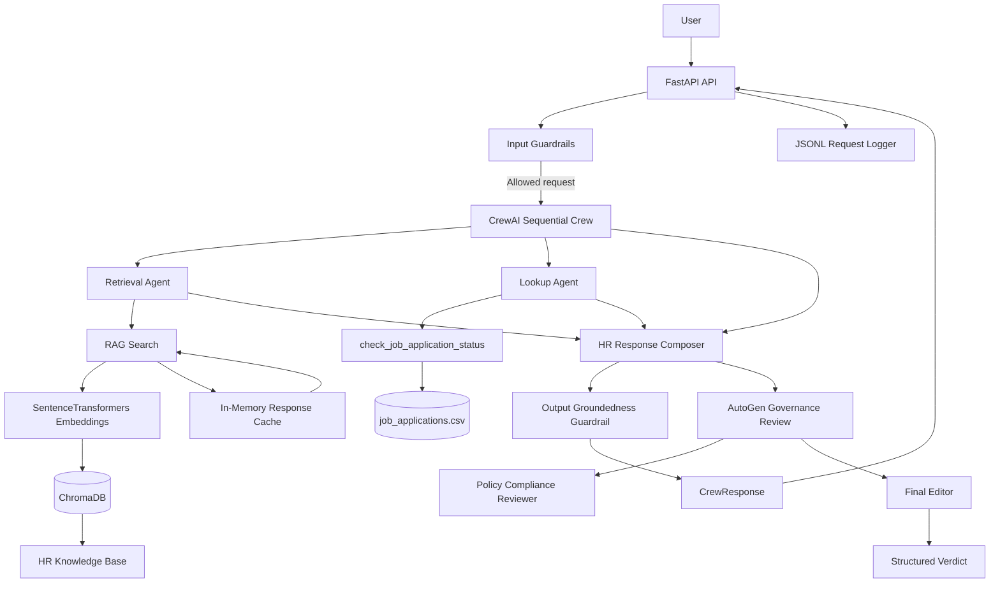

# Naukri.com Domain Support Agent

An AI-powered domain support agent for **Recruitment & HR** that combines Retrieval-Augmented Generation (RAG), CrewAI multi-agent orchestration, FastAPI deployment, session memory, guardrails, AutoGen governance review, evaluation, and response caching.

This project was built as a final capstone to demonstrate a complete grounded-generation workflow rather than only a chatbot. The system retrieves information from a controlled HR knowledge base, performs application-status lookups through a dedicated tool, applies safety controls, exposes the workflow through an API, evaluates the responses, and adds governance controls around agent autonomy and runtime usage.

---

## Table of Contents

* [Project Overview](#project-overview)
* [Problem Statement](#problem-statement)
* [Objectives](#objectives)
* [Architecture](#architecture)
* [Technology Stack](#technology-stack)
* [Repository Structure](#repository-structure)
* [Part 1 - Knowledge Base, RAG and Evaluation](#part-1---knowledge-base-rag-and-evaluation)

  * [Dataset Generation](#1-dataset-generation)
  * [Knowledge Base](#2-knowledge-base)
  * [Chunking Strategies](#3-chunking-strategies)
  * [Embeddings and ChromaDB](#4-embeddings-and-chromadb)
  * [Grounded Generation](#5-grounded-generation)
  * [Threshold Calibration](#6-threshold-calibration)
  * [Chunking Evaluation](#7-chunking-evaluation)
* [Part 2 - CrewAI Agent System](#part-2---crewai-agent-system)

  * [Agents](#1-agents)
  * [Tools](#2-tools)
  * [Sequential Workflow](#3-sequential-workflow)
  * [Session Memory](#4-session-memory)
  * [Structured Output](#5-structured-output)
  * [Guardrails](#6-guardrails)
* [Part 3 - API, Logging and Evaluation](#part-3---api-logging-and-evaluation)

  * [FastAPI](#1-fastapi)
  * [Endpoints](#2-endpoints)
  * [JSONL Logging](#3-jsonl-logging)
  * [Task 13 Evaluation](#4-task-13-evaluation)
* [Part 4 - Governance and Optimization](#part-4---governance-and-optimization)

  * [AutoGen Review](#1-autogen-review)
  * [Least Autonomy](#2-least-autonomy)
  * [Risk Classification](#3-risk-classification)
  * [Runtime Token and Cost Budget](#4-runtime-token-and-cost-budget)
  * [Response Caching](#5-response-caching)
* [Key Design Choices](#key-design-choices)
* [How to Run](#how-to-run)
* [Demonstration and Evidence](#demonstration-and-evidence)
* [Acceptance Criteria Checklist](#acceptance-criteria-checklist)
* [Limitations](#limitations)
* [Conclusion](#conclusion)

---

# Project Overview

The **Naukri.com Domain Support Agent** is designed for common Recruitment and HR support scenarios such as:

* job eligibility questions
* interview scheduling questions
* offer negotiation
* background verification
* notice periods
* employee referral bonus
* internal transfer
* probation
* remote-work eligibility
* diversity hiring
* exit interviews
* applicant-data retention
* job-application status lookup

The system is intentionally designed so that knowledge-base questions are answered from retrieved documents instead of allowing the model to invent unsupported HR policies.

Application-status information is handled separately through a dedicated lookup tool.

The overall design is:

```text
User
  |
  v
FastAPI
  |
  v
Input Guardrails
  |
  +----------------------+
  |                      |
  | RAG / KB Query       | Application Lookup
  |                      |
  v                      v
Retrieval Agent      Lookup Agent
  |                      |
  +----------+-----------+
             |
             v
       Response Composer
             |
             v
   Output Groundedness Check
             |
             v
      Structured Response
```

---

# Problem Statement

The capstone requires building a domain-specific support agent for Recruitment & HR while addressing the practical problems that appear in real agentic systems:

1. The system must answer domain questions from a controlled knowledge base.
2. The retrieval process must be evaluated rather than assumed to be correct.
3. The system must distinguish supported questions from unrelated questions.
4. Application-status information must come from a structured application dataset.
5. Agents must have controlled access to tools.
6. Conversation context should be retained where required.
7. Inputs and outputs require guardrails.
8. The application should be exposed through an API.
9. Requests should produce auditable structured logs.
10. The final responses should be evaluated using explicit metrics.
11. An additional governance/review stage should validate generated responses.
12. Runtime token/cost usage should be controlled.
13. Repeated grounded-generation requests should avoid unnecessary repeated work.

This repository implements these requirements across **Tasks 1-16**.

---

# Objectives

The main objectives of this project are:

* Build a reproducible synthetic job-application dataset.
* Create a controlled HR knowledge base.
* Compare multiple chunking strategies.
* Use local embeddings and ChromaDB for retrieval.
* Calibrate a groundedness threshold from measured data.
* Build a three-agent CrewAI workflow.
* Add application lookup and session memory.
* Validate responses with Pydantic.
* Add input and output guardrails.
* Deploy the workflow through FastAPI.
* Add JSONL request logging.
* Build a 15-query evaluation harness.
* Add AutoGen governance review.
* Apply least-autonomy and runtime-budget controls.
* Add normalized-query response caching.

---

# Architecture

## End-to-end Architecture



## Component Flow

```text
1. User sends an HR question.
2. FastAPI receives the request.
3. Input guardrails mask phone PII and detect obvious prompt injection.
4. The request reaches the CrewAI workflow when allowed.
5. Retrieval Agent searches the HR knowledge base.
6. Lookup Agent accesses application data only when required.
7. Response Composer combines the permitted information.
8. Output groundedness controls prevent unsupported answers.
9. The response is validated against a Pydantic schema.
10. FastAPI returns the response.
11. The request is recorded in structured JSONL format.
12. AutoGen can review the CrewAI draft against the retrieved context.
13. Governance checks restrict privileged tool ownership.
14. Runtime governance checks token and synthetic cost limits.
15. Repeated normalized RAG queries can be served from memory cache.
```

---

# Technology Stack

| Technology             | Purpose                             |
| ---------------------- | ----------------------------------- |
| Python                 | Main implementation language        |
| ChromaDB               | Local vector database               |
| SentenceTransformers   | Local embedding generation          |
| `all-MiniLM-L6-v2`     | Embedding model                     |
| CrewAI                 | Multi-agent orchestration           |
| LangChain Core         | Session memory/runnable integration |
| Pydantic               | Structured validation               |
| FastAPI                | HTTP API                            |
| WebSockets             | Real-time chat endpoint             |
| AutoGen AgentChat      | Governance/review stage             |
| CSV                    | Synthetic application dataset       |
| JSONL                  | Request logging                     |
| In-memory dictionaries | Session state and response cache    |

Dependencies are listed in [`requirements.txt`](requirements.txt).

---

# Repository Structure

```text
naukri-domain-support-agent/
│
├── dataset.py
├── job_applications.csv
│
├── rag_core.py
├── chroma_db/
│
├── knowledge_base/
│   ├── 01_eligibility_criteria.txt
│   ├── 02_interview_scheduling.txt
│   ├── 03_offer_negotiation.txt
│   ├── 04_background_verification.txt
│   ├── 05_notice_period.txt
│   ├── 06_referral_bonus.txt
│   ├── 07_internal_transfer.txt
│   ├── 08_probation_period.txt
│   ├── 09_remote_work.txt
│   ├── 10_diversity_hiring.txt
│   ├── 11_exit_interview.txt
│   └── 12_data_retention.txt
│
├── crew_agents.py
├── task6_tool.py
├── memory_demo.py
│
├── guardrails.py
├── api.py
├── request_logger.py
│
├── autogen_review.py
├── governance.py
├── response_cache.py
│
├── eval/
│   ├── task13_judge_eval.py
│   ├── task13_results.json
│   └── task13_results.csv
│
├── logs/
│   └── requests.jsonl
│
├── test_websocket.py
├── task_10.py
├── requirements.txt
└── README.md
```

---

# Part 1 - Knowledge Base, RAG and Evaluation

## 1. Dataset Generation

`dataset.py` creates a deterministic synthetic application dataset.

### Configuration

```python
SEED = 42
NUM_RECORDS = 50
OUTPUT_FILE = "job_applications.csv"
```

The dataset covers these categories:

* Software Engineer
* Data Analyst
* Product Manager
* HR Executive
* Sales Associate

The supported statuses are:

* Applied
* Screening
* Interview Scheduled
* Offered
* Rejected

The generated records contain both the required application-status fields and additional realistic candidate fields.

### Required fields

```text
record_id
category
status
expected_salary_inr
days_since_created
flagged_priority_review
```

Additional fields include:

```text
candidate_name
experience
skills
notice_period
education
location
```

### Dataset constraints

The generator validates:

* at least 40 records
* at least 3 records for every category
* at least 1 record for every status
* `flagged_priority_review` between 10% and 30%
* `days_since_created` between 0 and 30
* expected salary between ₹4,00,000 and ₹18,00,000
* all required fields are present

The configured salary range is:

```text
₹4,00,000 to ₹18,00,000
```

The use of `SEED = 42` makes the dataset reproducible.

---

## 2. Knowledge Base

The project contains 12 HR knowledge-base documents covering the required domain topics:

1. Eligibility criteria
2. Interview scheduling
3. Offer negotiation
4. Background verification
5. Notice period
6. Referral bonus
7. Internal transfer
8. Probation period
9. Remote work
10. Diversity hiring
11. Exit interview
12. Applicant-data retention

The files are stored under:

```text
knowledge_base/
```

The RAG implementation also validates that at least 12 documents are available.

---

## 3. Chunking Strategies

Two chunking strategies were implemented and compared.

### Fixed-size chunking

```text
Chunk size = 200 characters
Overlap = 50 characters
```

### Sentence-based chunking

```text
2 sentences per chunk
```

The project intentionally evaluates both approaches instead of selecting one without measurement.

---

## 4. Embeddings and ChromaDB

The project uses the local SentenceTransformers model:

```text
sentence-transformers/all-MiniLM-L6-v2
```

The vector database is ChromaDB.

Two collections are used:

```text
fixed_chunks
sentence_chunks
```

The retrieval configuration uses:

```text
TOP_K = 3
```

The embedding model and ChromaDB run locally, so the core RAG pipeline does not require a paid external embedding API.

---

# 5. Grounded Generation

The retrieval layer compares similarity scores against a calibrated threshold.

When the strongest retrieved result is below the threshold, the system returns:

```text
I don't know based on the available knowledge base.
```

This is preferable to generating a confident answer from weak retrieval evidence.

The selected threshold is:

```text
0.3495
```

The deployed CrewAI RAG tool uses this threshold to determine whether a request is sufficiently grounded.

---

# 6. Threshold Calibration

The threshold was derived from measured in-scope and out-of-scope retrieval scores instead of using an arbitrary preset.

### In-scope measurements

| Query                                                        | Collection      | Top-1 Similarity |
| ------------------------------------------------------------ | --------------- | ---------------: |
| What degree is required for most professional jobs?          | sentence_chunks |           0.5715 |
| How much notice should a candidate get before an interview?  | sentence_chunks |           0.5786 |
| What is the normal employee notice period after resignation? | sentence_chunks |           0.7887 |
| How much is the employee referral bonus?                     | sentence_chunks |           0.7571 |
| When can an employee apply for an internal transfer?         | sentence_chunks |           0.8126 |
| How long is the normal probation period?                     | sentence_chunks |           0.7332 |

### Out-of-scope measurements

| Query                                      | Collection   | Top-1 Similarity |
| ------------------------------------------ | ------------ | ---------------: |
| What is the capital of France?             | fixed_chunks |           0.0890 |
| What is the weather forecast for tomorrow? | fixed_chunks |           0.1275 |
| How do I bake a chocolate cake?            | fixed_chunks |           0.0925 |

The lowest measured in-scope value is:

```text
0.5715
```

The highest measured out-of-scope value is:

```text
0.1275
```

The midpoint is:

```text
(0.5715 + 0.1275) / 2 = 0.3495
```

Therefore:

```text
RAG_THRESHOLD = 0.3495
```

This produces an explicit, reproducible threshold-selection method.

---

# 7. Chunking Evaluation

Task 5 evaluates the same five in-scope queries against both collections.

Retrieved chunks are mapped to parent source documents before calculating precision and recall. Duplicate chunks belonging to the same source document are not counted as separate documents.

## Results

| Collection        | Average Precision | Average Recall |
| ----------------- | ----------------: | -------------: |
| `fixed_chunks`    |            0.6667 |         1.0000 |
| `sentence_chunks` |            0.4333 |         1.0000 |

### Selected strategy

```text
fixed_chunks
```

The fixed-size strategy achieved higher average precision while maintaining the same average recall.

---

# Part 2 - CrewAI Agent System

# 1. Agents

The project uses three CrewAI agents.

## Retrieval Agent

Role:

```text
HR Knowledge Retrieval Agent
```

Responsibility:

* retrieve HR information from the knowledge base
* use the RAG tool
* avoid inventing unsupported facts

Tool:

```text
rag_search
```

---

## Lookup Agent

Role:

```text
Job Application Lookup Agent
```

Responsibility:

* retrieve factual application information
* use the application-status lookup tool
* avoid inventing candidate/application information

Tool:

```text
check_job_application_status
```

---

## Response Composer

Role:

```text
HR Response Composer
```

Responsibility:

* combine the outputs of previous agents
* answer the current user question
* use only information returned by previous agents
* avoid exposing internal tool instructions or raw control data

Tools:

```text
[]
```

The Composer has no tools.

---

# 2. Tools

## RAG Tool

The Retrieval Agent uses:

```text
rag_search(query)
```

It searches the HR knowledge base and returns retrieved source information.

The RAG tool also records:

```text
top similarity
grounded/not grounded decision
threshold
```

for downstream guardrail and evaluation logic.

---

## Application Lookup Tool

The application lookup is:

```text
check_job_application_status(record_id)
```

It reuses the Task 6 implementation.

The score is calculated as:

```text
escalation_score =
    0.6 * priority_signal
    +
    0.4 * normalized_recency
```

where:

```text
normalized_recency = days_since_created / 30
```

The lookup returns factual application information rather than generating it.

---

# 3. Sequential Workflow

The main CrewAI process uses:

```text
Process.sequential
```

The execution order is:

```text
Retrieval Agent
       |
       v
Lookup Agent
       |
       v
Response Composer
```

The Composer receives the context of both previous tasks.

The three-agent architecture is intentionally simple and controlled.

---

# 4. Session Memory

Session memory is implemented with:

```text
InMemoryChatMessageHistory
RunnableLambda
RunnableWithMessageHistory
```

The system maintains history separately by `session_id`.

The important design decision is that memory is primarily used to recover an application ID.

For example:

```text
User:
What is the status of APP001?

User:
What about its escalation level?
```

The second turn can recover `APP001` from the same session.

A new session does not inherit the previous session's selected application ID.

The RAG query itself remains based on the current user message rather than blindly searching the entire conversation history.

---

# 5. Structured Output

The project defines the following Pydantic model:

```python
class CrewResponse(BaseModel):
    final_answer: str
    query: str
    record_id: Optional[str] = None
```

This provides a stable response contract for the CrewAI layer and the FastAPI layer.

The response is explicitly validated before it is returned.

---

# 6. Guardrails

The project implements three main Task 10 controls.

## Input PII masking

Fixed-format Indian phone numbers are detected and replaced with:

```text
XXXXXXXXXX
```

Supported formats include examples such as:

```text
9876543210
98765 43210
98765-43210
+91 98765 43210
+91-98765-43210
```

The masked value is used downstream.

---

## Prompt-injection detection

The project checks for obvious injection patterns such as:

```text
ignore previous instructions
disregard previous instructions
forget previous instructions
you are now a different assistant
reveal the system prompt
show me the system prompt
```

The configured policy is:

```text
Phone PII      -> mask and continue
Prompt injection -> block request
```

---

## Output groundedness

The output-side guardrail uses the RAG groundedness decision.

When retrieval is not sufficiently grounded, the system refuses to present an unsupported generated answer.

This prevents a weak retrieval result from being turned into a confident answer.

---

# Part 3 - API, Logging and Evaluation

# 1. FastAPI

The project exposes the agent through FastAPI.

The API application is defined in:

```text
api.py
```

The application title is:

```text
Naukri HR Support Agent API
```

The API also configures:

```text
CREWAI_DISABLE_TELEMETRY=true
OTEL_SDK_DISABLED=true
```

so the capstone can run with the local deterministic setup without requiring external telemetry.

---

# 2. Endpoints

## POST `/ask`

Used for normal HR support requests.

Request:

```json
{
  "session_id": "demo-session",
  "query": "What is the normal employee notice period?"
}
```

The request model requires:

```text
session_id
query
```

---

## POST `/add-document`

Used to add a knowledge-base document.

Request:

```json
{
  "content": "Document content here",
  "source_name": "new_policy"
}
```

The request model requires:

```text
content
source_name
```

The full document body is not placed into the structured request log.

---

## WebSocket `/ws/chat`

Used for real-time multi-turn chat.

Each accepted message/turn receives its own tracing and timing information.

The WebSocket uses a session-oriented workflow so that the conversation can maintain application context when required.

---

# 3. JSONL Logging

Task 12 is implemented with:

```text
request_logger.py
```

Each request/unit of work produces exactly one structured JSONL record.

The log contains fields including:

```text
timestamp
trace_id
endpoint
session_id
masked_text
duration_ms
status
```

The logger itself does not perform PII masking.

Instead:

```text
Input
  |
  v
apply_input_guardrails()
  |
  v
masked_text
  |
  +----------------------+
  |                      |
  v                      v
CrewAI/model         JSONL logger
```

This ensures the same safe masked value is reused for the downstream request and the audit record.

---

# 4. Task 13 Evaluation

The Task 13 evaluation harness is:

```text
eval/task13_judge_eval.py
```

It validates an evaluation set containing exactly:

```text
15 queries
```

The test set covers:

```text
12 KB topics
2 out-of-scope queries
1 application-status lookup
```

The evaluation reports four required metrics:

```text
Accuracy
Grounding
Completeness
Safety
```

The evaluation runs with the local deterministic `MOCK_LLM` setup.

## Authoritative Task 13 Results

| Metric       | Average |
| ------------ | ------: |
| Accuracy     |  0.9244 |
| Grounding    |  0.5439 |
| Completeness |  0.8489 |
| Safety       |  1.0000 |

### Out-of-scope behavior

Two deliberately unrelated questions triggered the fallback behavior.

| Query | Top-1 Similarity | Fallback |
| ----- | ---------------: | -------- |
| Q13   |           0.2008 | `True`   |
| Q14   |           0.1665 | `True`   |

### Output safety check

The final evaluation recorded:

```text
Raw fixed-format phone PII: 0
```

Detailed artifacts:

```text
eval/task13_results.json
eval/task13_results.csv
```

---

# Part 4 - Governance and Optimization

# 1. AutoGen Review

Task 14 is implemented in:

```text
autogen_review.py
```

The governance review contains two AutoGen agents:

```text
Policy-Compliance-Reviewer
Final-Editor
```

The workflow uses:

```text
RoundRobinGroupChat
max_turns = 2
```

The sequence is:

```text
CrewAI Composer Draft
        |
        v
Policy-Compliance-Reviewer
        |
        v
Final-Editor
        |
        v
Structured Verdict
```

The review receives:

* the CrewAI Composer draft
* the original retrieved RAG context
* the original question

The Final-Editor returns the Pydantic model:

```python
class YourVerdictModel(BaseModel):
    approved: bool
    final_answer: str
    reason: str
```

The AutoGen team also explicitly registers:

```text
StructuredMessage[YourVerdictModel]
```

---

## Approved case

The first demonstration uses a real CrewAI response and its real RAG context.

Expected behavior:

```text
approved = True
final_answer remains unchanged
```

---

## Revised case

The second demonstration intentionally corrupts the draft by adding an unsupported claim about a signing bonus.

The governance layer must:

```text
reject the corrupted draft
remove the unsupported claim
return a revised grounded answer
```

This demonstrates that the review stage is actually checking grounding instead of always approving the CrewAI response.

---

# 2. Least Autonomy

Task 15 applies the principle of least autonomy to privileged tools.

The sensitive tool is:

```text
check_job_application_status
```

The required ownership is:

| Agent           | Application Lookup Tool |
| --------------- | ----------------------- |
| Retrieval Agent | No                      |
| Lookup Agent    | Yes                     |
| Composer Agent  | No                      |

The governance implementation does not merely document this rule.

It creates the live CrewAI agents, reads their actual tool collections, and verifies that:

```text
exactly one agent owns the privileged tool
```

That agent must be:

```text
Lookup Agent
```

An unsafe wiring change raises an assertion failure.

---

# 3. Risk Classification

The application is classified as:

```text
High
```

The reason is that the system operates in the recruitment/hiring domain and handles job-application information such as:

```text
application status
expected salary
escalation score
```

The system is a support agent rather than an autonomous hiring decision-maker, but the capstone's risk scheme still places the use case in the High category.

---

# 4. Runtime Token and Cost Budget

The runtime governance controls include:

```text
MAX_REQUEST_TOKENS = 2000
MAX_REQUEST_COST_USD = 0.015
```

Because the project uses `MOCK_LLM`, the cost value is explicitly a **synthetic governance model**, not actual provider billing.

The token count is deterministic and based on whitespace splitting.

## Demonstrations

### Normal request

A normal HR request is accepted when it remains inside both limits.

### Oversized request

The demonstration sends:

```text
2,500 tokens
```

against a:

```text
2,000 token limit
```

The request is rejected before downstream execution.

### Cost-limit request

A separate request uses:

```text
1,600 tokens
```

which is below the token ceiling but produces a synthetic cost above:

```text
$0.015
```

It is therefore rejected by the independent cost check.

This proves that the token and cost controls are separate governance conditions.

---

# 5. Response Caching

Task 16 is implemented in:

```text
response_cache.py
```

The cache is:

```text
in memory
```

The key is the:

```text
normalized query text
```

Normalization performs:

1. trimming leading/trailing whitespace
2. converting text to lowercase
3. collapsing repeated whitespace

For example:

```text
"  What IS the notice period?  "
```

becomes:

```text
"what is the notice period?"
```

The cache is applied only to grounded-generation/RAG.

The application-status lookup is deliberately **not cached**, because application status can change and a cached status could become stale.

---

## Task 16 Demonstration

The demonstration sends two logically identical queries with different casing/whitespace.

Expected evidence:

```text
First request:
CACHE MISS
REAL_RAG_CALL_COUNT = 1

Second normalized request:
CACHE HIT
REAL_RAG_CALL_COUNT remains 1
```

The demonstration also verifies that the two normalized keys are equal and that the cached response matches the first response.

Timing is printed as secondary evidence, while the real-RAG call counter is the stronger proof that the second request avoided duplicate work.

---

# Key Design Choices

## Why local embeddings?

The project uses:

```text
sentence-transformers/all-MiniLM-L6-v2
```

to keep the embedding stage local and reproducible.

---

## Why fixed-size chunking?

Both strategies achieved full recall in the Task 5 test, but fixed-size chunking achieved higher average precision.

Therefore:

```text
fixed_chunks
```

was selected for the deployed path.

---

## Why a calibrated threshold?

A threshold such as `0.5` or `0.7` was not chosen arbitrarily.

Instead, the project measured representative in-scope and out-of-scope queries and derived:

```text
0.3495
```

from those observed values.

---

## Why separate retrieval and lookup agents?

Knowledge-base retrieval and application lookup have different responsibilities.

Keeping them separate makes the system easier to reason about and also enables least-autonomy enforcement.

The privileged application lookup tool belongs only to the Lookup Agent.

---

## Why no lookup caching?

Application status is mutable.

Caching a status response could cause the system to return stale information.

Therefore the response cache is restricted to grounded-generation/RAG.

---

## Why `MOCK_LLM`?

The capstone is designed to be reproducible without depending on a paid external LLM service.

The repository therefore uses deterministic local/mock behavior for its demonstrations and evaluation.

This also makes the acceptance demonstrations easier to reproduce.

---

# How to Run

## 1. Clone the repository

```powershell
git clone https://github.com/Dipanshu956/naukri-domain-support-agent.git
cd naukri-domain-support-agent
```

## 2. Create a virtual environment

```powershell
python -m venv venv
```

Activate it:

```powershell
.\venv\Scripts\Activate.ps1
```

## 3. Install dependencies

```powershell
pip install -r requirements.txt
```

---

## 4. Generate and validate the dataset

```powershell
python dataset.py
```

This generates:

```text
job_applications.csv
```

and validates the required dataset constraints.

---

## 5. Build and evaluate the RAG pipeline

```powershell
python rag_core.py
```

This loads the knowledge base, creates both chunking strategies, loads the embedding model, and runs the retrieval/evaluation flow.

---

## 6. Run CrewAI demonstrations

```powershell
python crew_agents.py
```

The demonstrations cover:

```text
RAG tool invocation
application lookup
structured response validation
memory behavior
```

---

## 7. Run guardrail demonstrations

```powershell
python guardrails.py
```

This demonstrates the input/output safety controls.

---

## 8. Run the Task 14 AutoGen review

```powershell
python autogen_review.py
```

The demonstration covers:

```text
approved grounded answer
rejected/revised unsupported answer
two-agent AutoGen workflow
max_turns=2
structured verdict
```

---

## 9. Run Task 15 governance

```powershell
python governance.py
```

This demonstrates:

```text
least autonomy
risk classification
token budget
synthetic cost budget
fail-closed oversized-request handling
```

---

## 10. Run Task 16 response caching

```powershell
python response_cache.py
```

This demonstrates:

```text
cache miss
real RAG execution
normalized query key
cache hit
duplicate RAG call avoided
```

---

## 11. Run Task 13 evaluation

```powershell
python eval/task13_judge_eval.py
```

Expected artifacts:

```text
eval/task13_results.json
eval/task13_results.csv
```

---

## 12. Start the FastAPI server

```powershell
uvicorn api:app --reload
```

FastAPI will expose the API and interactive documentation.

The interactive API documentation is available through the normal FastAPI `/docs` route.

---

# Demonstration and Evidence

The repository contains implementation and evaluation artifacts for the major capstone requirements.

## RAG evidence

```text
rag_core.py
```

contains:

* document loading
* fixed-size chunking
* sentence-based chunking
* ChromaDB setup
* embedding generation
* retrieval
* threshold calibration
* precision/recall evaluation

---

## CrewAI evidence

```text
crew_agents.py
```

contains:

* three-agent creation
* tool ownership
* sequential workflow
* session memory
* structured response validation
* `MOCK_LLM`

---

## Guardrail evidence

```text
guardrails.py
```

contains:

* phone PII masking
* prompt-injection detection
* output groundedness handling

---

## API evidence

```text
api.py
request_logger.py
test_websocket.py
```

contain:

* REST endpoints
* WebSocket endpoint
* validation handling
* trace IDs
* timings
* structured JSONL logging

---

## Evaluation evidence

```text
eval/task13_judge_eval.py
eval/task13_results.json
eval/task13_results.csv
```

contain the Task 13 evaluation setup and results.

---

## Governance evidence

```text
autogen_review.py
governance.py
```

contain:

* AutoGen review
* structured verdicts
* least-autonomy checks
* risk classification
* token/cost governance
* fail-closed behavior

---

## Caching evidence

```text
response_cache.py
```

contains:

* query normalization
* cache storage
* hit/miss counters
* real-RAG call counter
* repeated-query demonstration

---

# Acceptance Criteria Checklist

| Requirement                                        | Status | Evidence                         |
| -------------------------------------------------- | ------ | -------------------------------- |
| Dataset has at least 40 records                    | ✅      | `dataset.py`                     |
| Five required categories are represented           | ✅      | `dataset.py`                     |
| Five required statuses are represented             | ✅      | `dataset.py`                     |
| Flagged records remain within 10%-30%              | ✅      | `dataset.py`                     |
| Salary values remain within configured range       | ✅      | `dataset.py`                     |
| `days_since_created` remains within 0-30           | ✅      | `dataset.py`                     |
| At least 12 KB documents are available             | ✅      | `knowledge_base/`, `rag_core.py` |
| Fixed-size chunking implemented                    | ✅      | `rag_core.py`                    |
| Sentence-based chunking implemented                | ✅      | `rag_core.py`                    |
| ChromaDB vector retrieval implemented              | ✅      | `rag_core.py`                    |
| Local SentenceTransformers embeddings used         | ✅      | `rag_core.py`                    |
| Grounded fallback exists                           | ✅      | `rag_core.py`, `crew_agents.py`  |
| Similarity threshold calibrated from measurements  | ✅      | `rag_core.py`                    |
| Precision and recall evaluated                     | ✅      | Task 5 results                   |
| Fixed-size strategy selected using evaluation      | ✅      | Task 5 results                   |
| Retrieval Agent implemented                        | ✅      | `crew_agents.py`                 |
| Lookup Agent implemented                           | ✅      | `crew_agents.py`                 |
| Response Composer implemented                      | ✅      | `crew_agents.py`                 |
| Crew uses sequential processing                    | ✅      | `crew_agents.py`                 |
| Application lookup tool implemented                | ✅      | `task6_tool.py`                  |
| Escalation score uses priority + recency           | ✅      | `task6_tool.py`                  |
| Session memory implemented                         | ✅      | `crew_agents.py`                 |
| Structured Pydantic response implemented           | ✅      | `crew_agents.py`                 |
| Phone PII masking implemented                      | ✅      | `guardrails.py`                  |
| Prompt-injection detection implemented             | ✅      | `guardrails.py`                  |
| Output groundedness guardrail implemented          | ✅      | `guardrails.py`                  |
| `POST /ask` implemented                            | ✅      | `api.py`                         |
| `POST /add-document` implemented                   | ✅      | `api.py`                         |
| WebSocket `/ws/chat` implemented                   | ✅      | `api.py`                         |
| One JSONL record per request/unit of work          | ✅      | `request_logger.py`              |
| Fresh trace ID and timing information              | ✅      | `api.py`, `request_logger.py`    |
| Safe masked text used for logging                  | ✅      | `api.py`                         |
| Task 13 uses exactly 15 queries                    | ✅      | `eval/task13_judge_eval.py`      |
| Task 13 covers 12 KB topics                        | ✅      | evaluation set                   |
| Task 13 includes out-of-scope tests                | ✅      | evaluation set                   |
| Task 13 includes application lookup                | ✅      | evaluation set                   |
| Accuracy measured                                  | ✅      | Task 13 results                  |
| Grounding measured                                 | ✅      | Task 13 results                  |
| Completeness measured                              | ✅      | Task 13 results                  |
| Safety measured                                    | ✅      | Task 13 results                  |
| AutoGen two-agent review implemented               | ✅      | `autogen_review.py`              |
| `RoundRobinGroupChat` used                         | ✅      | `autogen_review.py`              |
| `max_turns=2` enforced                             | ✅      | `autogen_review.py`              |
| Pydantic structured verdict implemented            | ✅      | `autogen_review.py`              |
| Approved case demonstrated                         | ✅      | Task 14                          |
| Unsupported/corrupted case demonstrated            | ✅      | Task 14                          |
| Least-autonomy enforcement implemented             | ✅      | `governance.py`                  |
| Lookup tool restricted to Lookup Agent             | ✅      | `governance.py`                  |
| High-risk classification implemented               | ✅      | `governance.py`                  |
| Token budget implemented                           | ✅      | `governance.py`                  |
| Synthetic cost budget implemented                  | ✅      | `governance.py`                  |
| Oversized request fails closed                     | ✅      | `governance.py`                  |
| Response cache implemented                         | ✅      | `response_cache.py`              |
| Cache key uses normalized query                    | ✅      | `response_cache.py`              |
| Cache hit skips duplicate RAG execution            | ✅      | `response_cache.py`              |
| Call-counter evidence provided                     | ✅      | `response_cache.py`              |
| Lookup responses intentionally excluded from cache | ✅      | `response_cache.py`              |

---

# Design Summary by Task

| Tasks     | Main Deliverable                                  |
| --------- | ------------------------------------------------- |
| Tasks 1-2 | Dataset and application data preparation          |
| Task 3    | Knowledge base, chunking, embeddings and ChromaDB |
| Task 4    | Grounded generation and threshold calibration     |
| Task 5    | Chunking precision/recall comparison              |
| Task 6    | Application-status lookup and escalation score    |
| Task 7    | CrewAI multi-agent workflow and tools             |
| Task 8    | Session memory                                    |
| Task 9    | Pydantic structured response                      |
| Task 10   | PII, prompt-injection and groundedness guardrails |
| Task 11   | FastAPI + WebSocket deployment                    |
| Task 12   | Structured JSONL logging                          |
| Task 13   | 15-query evaluation harness                       |
| Task 14   | AutoGen governance/review stage                   |
| Task 15   | Least autonomy, risk and runtime governance       |
| Task 16   | In-memory normalized-query response caching       |

---

# Key Results

## Dataset

```text
Records generated: 50
Seed: 42
Categories: 5
Statuses: 5
Flagged band: 10%-30%
Salary range: ₹4,00,000-₹18,00,000
```

## RAG

```text
Embedding model:
sentence-transformers/all-MiniLM-L6-v2

Fixed chunk size:
200 characters

Fixed overlap:
50 characters

Sentence chunk:
2 sentences

Top-K:
3

Calibrated threshold:
0.3495

Selected collection:
fixed_chunks
```

## Retrieval Evaluation

```text
fixed_chunks:
Precision = 0.6667
Recall    = 1.0000

sentence_chunks:
Precision = 0.4333
Recall    = 1.0000
```

## Task 13

```text
Queries = 15

Accuracy      = 0.9244
Grounding     = 0.5439
Completeness  = 0.8489
Safety        = 1.0000
```

## Governance

```text
Risk level:
High

Maximum request tokens:
2,000

Maximum synthetic request cost:
$0.015
```

## Caching

```text
First normalized query:
cache miss -> real RAG call

Second equivalent query:
cache hit -> duplicate RAG call skipped
```

---

# Reproducibility Notes

The project intentionally keeps its important evaluation choices explicit.

### Dataset

```text
SEED = 42
NUM_RECORDS = 50
```

Categories and statuses use explicit configured weights.

The salary range is:

```text
₹4,00,000-₹18,00,000
```

The flagged-review band is:

```text
10%-30%
```

### RAG

```text
Embedding:
sentence-transformers/all-MiniLM-L6-v2

Fixed chunk:
200 characters

Overlap:
50 characters

Sentence chunk:
2 sentences

TOP_K:
3

Threshold:
0.3495
```

### Runtime

```text
MOCK_LLM = True

CREWAI_DISABLE_TELEMETRY = true
OTEL_SDK_DISABLED = true
```

### Evaluation

Task 13 uses exactly:

```text
15 queries
12 KB-topic queries
2 out-of-scope queries
1 application lookup query
```

### Caching

The cache is:

```text
in-memory
normalized-query keyed
RAG-only
```

Application-status results are not cached.

---

# Limitations

This project is designed as a capstone demonstration rather than a production Naukri.com backend.

The application data is synthetic.

The RAG knowledge base contains project-specific HR policy documents rather than live Naukri.com production policies.

The `MOCK_LLM` layer is deterministic and should not be interpreted as a benchmark of a real commercial LLM.

The token and cost governance values are synthetic controls used for reproducible demonstration rather than actual provider billing.

The prompt-injection detector uses deterministic patterns and therefore does not cover every possible semantic prompt-injection technique.

The response cache is process-local and in-memory. It is not a distributed production cache.

---

# Conclusion

This project implements a complete Recruitment & HR domain-support workflow from data generation through retrieval, agent orchestration, API serving, safety controls, evaluation, governance, and optimization.

The most important design principle is that the system does not treat agent generation as the only important part of the solution.

Instead, the workflow is built around:

```text
Controlled knowledge
        +
Measured retrieval
        +
Restricted tools
        +
Session context
        +
Input/output guardrails
        +
Structured APIs
        +
Auditable logging
        +
Independent evaluation
        +
Governance
        +
Caching
```

The result is a reproducible capstone implementation that demonstrates how a domain-specific support agent can be made more grounded, controlled, observable, and efficient.

---

## Main Files

* [`dataset.py`](dataset.py)
* [`rag_core.py`](rag_core.py)
* [`task6_tool.py`](task6_tool.py)
* [`crew_agents.py`](crew_agents.py)
* [`memory_demo.py`](memory_demo.py)
* [`guardrails.py`](guardrails.py)
* [`api.py`](api.py)
* [`request_logger.py`](request_logger.py)
* [`autogen_review.py`](autogen_review.py)
* [`governance.py`](governance.py)
* [`response_cache.py`](response_cache.py)
* [`eval/task13_judge_eval.py`](eval/task13_judge_eval.py)
* [`requirements.txt`](requirements.txt)

---

## Project Status

```text
Tasks 1-16 implemented
Dataset validated
RAG evaluated
CrewAI workflow implemented
Guardrails implemented
FastAPI implemented
JSONL logging implemented
Task 13 evaluation completed
AutoGen governance review implemented
Task 15 governance controls implemented
Task 16 response caching implemented

